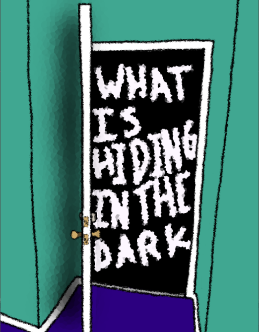
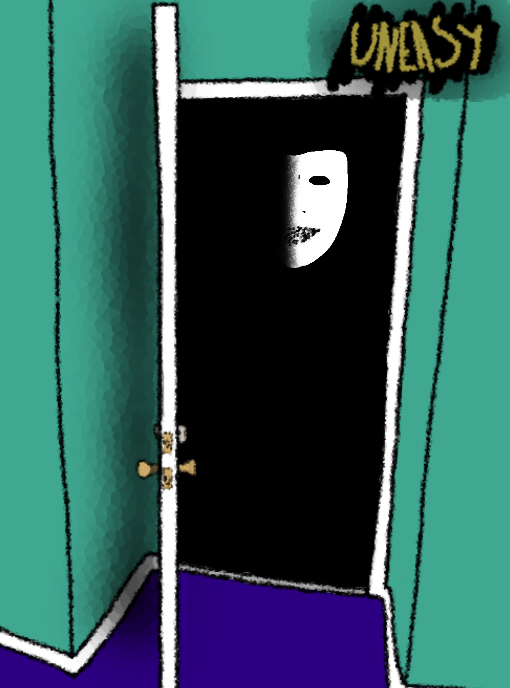

# What Is Hiding In The Dark

What is that there? Hiding out there? You swear when you look out your door that the entire world is drenched in darkness. All you can see is an empty vacuum of space from which anything could emerge. How can it even be that dark? Was it usually that dark? It couldn't be. The same two people keep trying to get candy from you, but you don't even think it is Halloween yet. Weird things just seem to be happening, but hey, it's not all bad. You've got this sweet potion clicker game on your computer to pass the time, so that's cool.

This is my submission to Spooky 2D Jam '22. The jam's theme is "What's hiding in the dark?"

-------

   

-------

[Play on itch.io &raquo;](https://marmadilemanteater.itch.io/what-is-hiding-in-the-dark)
